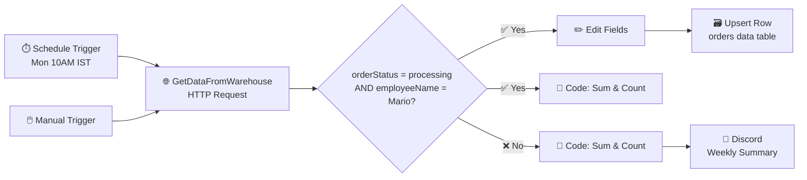

[README.md](https://github.com/user-attachments/files/30652511/README.2.md)
# 📦 Nathan Workflow — Automated Order Booking Tracker

An [n8n](https://n8n.io) automation that pulls order data from a company warehouse API, filters for a specific employee's processing orders, logs matches to a Data Table, and posts a weekly booking summary to Discord — hands-free.

## 🔁 Workflow Diagram

## ⚙️ How it works

1. **Triggers**
   - `When clicking 'Execute workflow'` — manual trigger for testing.
   - `TriggerMondays10am` — schedule trigger that runs every Monday at 10:00 AM (`Asia/Kolkata` timezone).

2. **GetDataFromWarehouse** — makes an HTTP request to the company warehouse endpoint (header-based auth) to fetch order records.

3. **If** — filters orders where:
   - `orderStatus` equals `processing`, **and**
   - `employeeName` equals `Mario`

4. **True branch** (matches filter):
   - `Edit Fields` — extracts `orderID` and `employeeName`.
   - `Upsert row(s)` — inserts/updates the matching order into the **orders data** n8n Data Table (keyed on `orderID`).
   - `Code in JavaScript1` — computes total booked count and summed order value.

5. **False branch** (doesn't match filter):
   - `Code in JavaScript` — computes total booked count and summed order value for all fetched orders.
   - `Discord` — posts a weekly summary message (order count + total value) to a Discord channel via webhook.

## 🧰 Requirements

| Requirement | Purpose |
|---|---|
| n8n instance (self-hosted or cloud) | Runs the workflow |
| **HTTP Header Auth** credential | Authenticates the warehouse API request |
| **Discord Webhook** credential | Posts the weekly summary message |
| n8n **Data Table**: `orders data` | Stores matched orders (`orderID`, `customerID`, `employeeName`, `orderPrice`, `orderStatus`) |

## 🚀 Setup

1. **Import** `nathan_workflow.json` into n8n
   → Editor → **Workflows** → **Import from File** → select `nathan_workflow.json`
2. **Reconnect credentials**
   → Open `GetDataFromWarehouse` → set HTTP Header Auth
   → Open `Discord` → set Discord Webhook
3. **Verify/create** the `orders data` Data Table referenced by `Upsert row(s)`
4. **Adjust the schedule** (day/hour/timezone) if needed
5. **Activate** the workflow ✅

## 📁 Repo Contents

| File | Description |
|---|---|
| `nathan_workflow.json` | Exported n8n workflow definition (nodes, connections, settings) — import directly into n8n |
| `README.md` | This file |
| `Workflow image` | Image | |

## 📝 Notes

- The workflow is exported with `"active": true` — review before activating in a new environment to avoid duplicate scheduled runs.
- Credentials are **not** included in the export (n8n never exports secrets) — reconnect them after import.
- Schedule is set to **Mondays, 10:00 AM, Asia/Kolkata** — update in the `TriggerMondays10am` node to match your timezone.

---

<i>Built with n8n 🔗</i>

